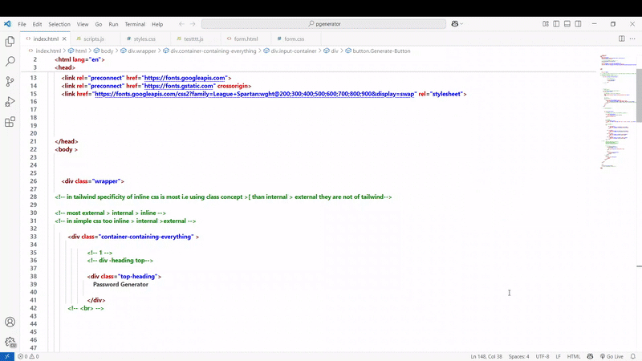

# Password Generator 🔒✨

A simple and user-friendly Password Generator app built with HTML, CSS, and vanilla JavaScript. This project lets you create random passwords by choosing options like uppercase letters, lowercase letters, numbers, and symbols. It’s a great way to showcase my skills in building interactive web apps! 🚀

## 🎥 Demo
Check out the Password Generator in action! (Add a GIF or screenshot after recording)



## 🌟 Features
- Create Random Passwords 🔧: Choose options to include uppercase, lowercase, numbers, and symbols.
- Adjust Password Length 📏: Use a slider to set the password length (0–20 characters).
- Check Password Strength 💪: See if your password is weak, medium, or strong with a color indicator.
- Copy Password 📋: Copy the generated password with one click and get a "Copied!" message.
- Clear Everything 🗑️: Reset all settings and the password with a clear button.
- Looks Great on Any Device 📱: The design works well on both mobile and desktop.

## 📖 Preview
A clean and colorful Password Generator! 🔑  
- Title: A bold "Password Generator" heading at the top.
- Password Box: Shows the generated password with a copy button next to it.
- Slider: Lets you pick the password length and shows the number above it.
- Checkboxes: Pick which characters to include (uppercase, lowercase, numbers, symbols).
- Strength Indicator: A small circle that changes color (red, yellow, green) based on password strength.
- Buttons: "Generate Password" to make a new password and "Clear" to start over.

## 📂 Project Structure
```
PasswordGenerator/
- images/              # Folder for icons used in the app 🖼️
  - copy.svg          # Copy icon for the copy button 📋
  - check-markk.png   # Checkmark icon shown after copying ✅
- index.html          # Main HTML file 📄
- styles.css          # Styles for the app 🎨
- scripts.js          # Code to make the app work 🔧
- README.md           # Project documentation 📖
```

## 🚀 Setup Instructions
1. **Clone the Repository**:
   ```bash
   git clone https://github.com/root-kush369/PasswordGenerator.git
   ```
2. **Navigate to the Project Directory**:
   ```bash
   cd PasswordGenerator
   ```
3. **Open the App**:
   - Open index.html in a browser to try it out by  any liveServer Extension. 
     No extra setup needed! 🖥️

## 🛠️ Technologies Used
- HTML5 📄: Used to build the structure of the app.
- CSS3 🎨: Added styles like colors, layouts, and a gradient background.
- Vanilla JavaScript 🔧: Made the app interactive with features like generating passwords and copying text.
- Google Fonts (League Spartan) 🖌️: Used a nice font for the text, loaded from Google Fonts.

## 🔍 How It Works
- Generating Passwords 🔑: Creates a random password using the options you pick (uppercase, lowercase, numbers, symbols).
- Slider for Length 📏: The slider lets you choose the password length, and the number above it updates as you move the slider.
- Strength Indicator 💪: Shows the password strength with a colored circle (red for weak, yellow for medium, green for strong).
- Copy Feature 📋: Click the copy button to copy the password, and see a "Copied!" message with a checkmark.
- Clear Button 🗑️: Resets the password, slider, and checkboxes to start fresh.

## 📦 Deployment Tips
- Make Images Smaller: Use [TinyPNG](https://tinypng.com/) to shrink `copy.svg` and `check-markk.png`.
- Run Locally: Just open `index.html` in a browser—no server needed.
- Share Online: Upload the folder to GitHub Pages or Netlify to share a live demo.

## 🤝 Contributing
Want to make this app better? Fork the repository, make your changes, and submit a pull request! 🌟

## 📜 License
This project is licensed under the MIT License - see the [LICENSE](LICENSE) file for details.

## 📬 Contact
Got questions or feedback? Reach out to me at [5kushbhardwaj7@gmail.com] or open an issue on GitHub. Let’s talk about coding! 💬

---

Built with ❤️ by [Kush Bhardwaj](https://github.com/root-kush369)
